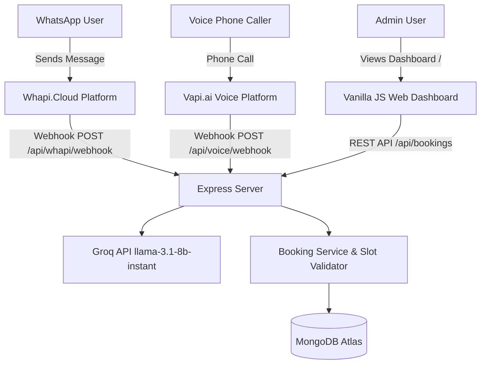

# 🧠 Project Context & Operations Log (`context.md`)

This file tracks the session context, ongoing architectural state, file creation/update/deletion history, and active roadmap for the **Car Wash Booking Agent (Dual-Channel: WhatsApp + Voice)**.

---

## 📌 Session Overview

- **Project Name**: Car Wash Booking Agent
- **Target Channels**:
  1. **WhatsApp Agent**: Integrated via Whapi.Cloud (`whapi.cloud`) & Groq LLM (`llama-3.1-8b-instant`)
  2. **Voice Calling Agent**: Integrated via **Vapi.ai (vapi.ai)** Voice Platform (Tool Calls, Webhooks & Outbound Calling)
- **Stack**: Node.js, Express, Mongoose (MongoDB Atlas), Groq SDK, Axios, Vanilla HTML/CSS/JS + TailwindCSS (Admin Dashboard)
- **Current Status**: Codebase fully cleaned, single root `.env` configured, duplicates removed, server & ngrok running live.

---

## 📑 Operations Log (Add / Update / Delete Track)

### 🟢 Active Files

| File Path                                                                                                                           | Description / Responsibility                                                                   | Status |
| :---------------------------------------------------------------------------------------------------------------------------------- | :--------------------------------------------------------------------------------------------- | :----- |
| [`package.json`](file:///c:/Users/HD/Downloads/Car%20Wash%20Booking%20Agent/package.json)                                           | Node package manifest with Express, Mongoose, Groq SDK, Axios, Cors, Morgan                    | Active |
| [`.gitignore`](file:///c:/Users/HD/Downloads/Car%20Wash%20Booking%20Agent/.gitignore)                                               | Git exclusion rules (`node_modules`, `.env`, `chroma_db`)                                      | Active |
| [`.env`](file:///c:/Users/HD/Downloads/Car%20Wash%20Booking%20Agent/.env)                                                           | Single root environment configuration file (Ignored by Git)                                    | Active |
| [`.env.example`](file:///c:/Users/HD/Downloads/Car%20Wash%20Booking%20Agent/.env.example)                                           | Root environment variable template for version control                                         | Active |
| [`ngrok.yml`](file:///c:/Users/HD/Downloads/Car%20Wash%20Booking%20Agent/ngrok.yml)                                                 | Pre-configured ngrok tunnel configuration for port 5000                                        | Active |
| [`README.md`](file:///c:/Users/HD/Downloads/Car%20Wash%20Booking%20Agent/README.md)                                                 | Comprehensive setup documentation & account creation links                                     | Active |
| [`server/index.js`](file:///c:/Users/HD/Downloads/Car%20Wash%20Booking%20Agent/server/index.js)                                     | Express server (morgan logging, 3-attempt MongoDB retry, groq client export)                   | Active |
| [`server/models/Booking.js`](file:///c:/Users/HD/Downloads/Car%20Wash%20Booking%20Agent/server/models/Booking.js)                   | Mongoose schema (bookingId, channel, status, customerInfo, vehicleInfo, appointment)           | Active |
| [`server/services/bookingService.js`](file:///c:/Users/HD/Downloads/Car%20Wash%20Booking%20Agent/server/services/bookingService.js) | Session store (`getOrCreateSession`), `extractBookingInfo`, `updateBookingFromExtraction`      | Active |
| [`server/services/whapiService.js`](file:///c:/Users/HD/Downloads/Car%20Wash%20Booking%20Agent/server/services/whapiService.js)     | Whapi.Cloud API Client (`sendTextMessage`, `verifyWebhookToken`, `parseIncomingMessage`)       | Active |
| [`server/routes/whapi.js`](file:///c:/Users/HD/Downloads/Car%20Wash%20Booking%20Agent/server/routes/whapi.js)                       | Whapi.Cloud WhatsApp Webhook Handler (11-step async pipeline, 200 immediate)                   | Active |
| [`server/routes/voice.js`](file:///c:/Users/HD/Downloads/Car%20Wash%20Booking%20Agent/server/routes/voice.js)                       | Vapi.ai Voice Webhook Handler (`end-of-call-report`, `call-started`, cross-channel WA)         | Active |
| [`server/routes/bookings.js`](file:///c:/Users/HD/Downloads/Car%20Wash%20Booking%20Agent/server/routes/bookings.js)                 | REST API endpoints for admin dashboard CRUD & today stats                                      | Active |
| [`prompts/whatsapp_system_prompt.md`](file:///c:/Users/HD/Downloads/Car%20Wash%20Booking%20Agent/prompts/whatsapp_system_prompt.md) | Production System Prompt for Washy 🚗 (JSON format, 5 few-shot examples, Urdu terms)           | Active |
| [`prompts/voice_agent_prompt.md`](file:///c:/Users/HD/Downloads/Car%20Wash%20Booking%20Agent/prompts/voice_agent_prompt.md)         | Voice System Prompt for Washy 🎙️ (No emojis/markdown, 6-step confirmation flow)                | Active |
| [`prompts/vapi_config.json`](file:///c:/Users/HD/Downloads/Car%20Wash%20Booking%20Agent/prompts/vapi_config.json)                   | VAPI.ai Assistant Export Config (`11labs` voice, `gpt-4o-mini`, `serverUrlSecret`)             | Active |
| [`client/index.html`](file:///c:/Users/HD/Downloads/Car%20Wash%20Booking%20Agent/client/index.html)                                 | Single-page Dashboard (TailwindCSS CDN, 30s auto-refresh, 4 stats cards, PKR revenue, filters) | Active |

### 🔴 Deleted Redundant Files

- `server/routes/wapi.js`: Removed in favor of standardized `server/routes/whapi.js`.
- `server/services/wapiService.js`: Removed in favor of standardized `server/services/whapiService.js`.
- `server/.env.example`: Removed in favor of single root `.env.example`.

---

## 🏗️ Architecture & Component Context

