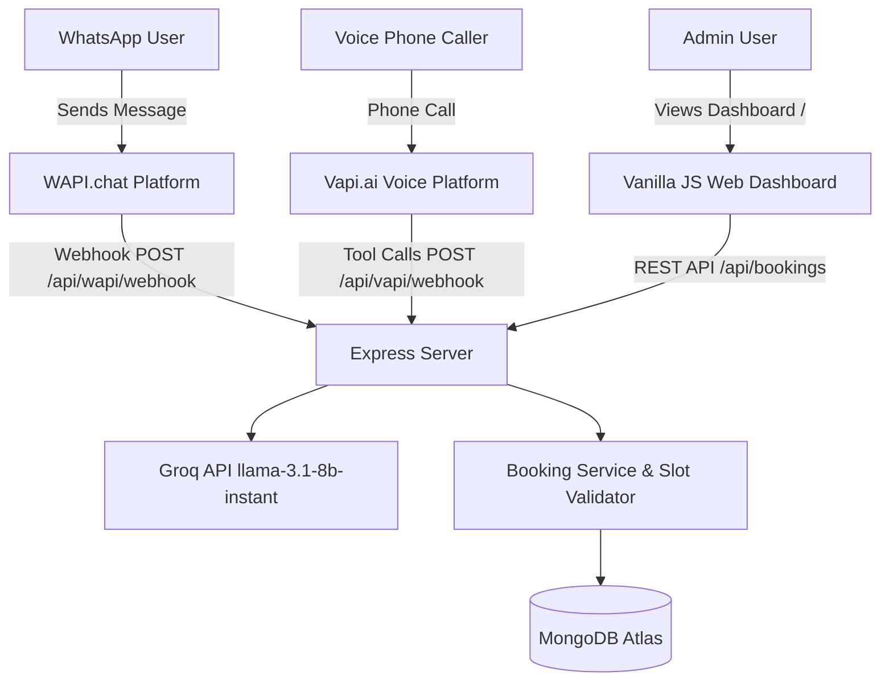

# 🧠 Project Context & Operations Log (`context.md`)

This file tracks the session context, ongoing architectural state, file creation/update/deletion history, and active roadmap for the **Car Wash Booking Agent (Dual-Channel: WhatsApp + Voice)**.

---

## 📌 Session Overview

- **Project Name**: Car Wash Booking Agent
- **Target Channels**:
  1. **WhatsApp Agent**: Integrated via WAPI (`wapi.chat`) & Groq LLM (`llama-3.1-8b-instant`)
  2. **Voice Calling Agent**: Integrated via **Vapi.ai (vapi.ai)** Voice Platform (Tool Calls, Webhooks & Outbound Calling)
- **Stack**: Node.js, Express, Mongoose (MongoDB Atlas), Groq SDK, Axios, Vanilla HTML/CSS/JS (Admin Dashboard)
- **Current Status**: Project structure created, Vapi AI (vapi.ai) voice integration configured, dependencies installed, ready for production testing.

---

## 📑 Operations Log (Add / Update / Delete Track)

### 🟢 Added Files

| File Path                                                                                                                           | Description / Responsibility                                                                   | Status |
| :---------------------------------------------------------------------------------------------------------------------------------- | :--------------------------------------------------------------------------------------------- | :----- |
| [`package.json`](file:///c:/Users/HD/Downloads/Car%20Wash%20Booking%20Agent/package.json)                                           | Node package manifest with Express, Mongoose, Groq SDK, Axios, Cors                            | Active |
| [`.gitignore`](file:///c:/Users/HD/Downloads/Car%20Wash%20Booking%20Agent/.gitignore)                                               | Git exclusion rules (`node_modules`, `.env`, logs)                                             | Active |
| [`.env`](file:///c:/Users/HD/Downloads/Car%20Wash%20Booking%20Agent/.env)                                                           | Active root environment configuration file (Ignored by Git)                                    | Active |
| [`.env.example`](file:///c:/Users/HD/Downloads/Car%20Wash%20Booking%20Agent/.env.example)                                           | Root environment variable template for version control                                         | Active |
| [`ngrok.yml`](file:///c:/Users/HD/Downloads/Car%20Wash%20Booking%20Agent/ngrok.yml)                                                 | Pre-configured ngrok tunnel configuration for port 5000                                        | Active |
| [`README.md`](file:///c:/Users/HD/Downloads/Car%20Wash%20Booking%20Agent/README.md)                                                 | Comprehensive setup documentation & account creation links                                     | Active |
| [`server/index.js`](file:///c:/Users/HD/Downloads/Car%20Wash%20Booking%20Agent/server/index.js)                                     | Express server (morgan logging, 3-attempt MongoDB retry, groq client export)                   | Active |
| [`server/models/Booking.js`](file:///c:/Users/HD/Downloads/Car%20Wash%20Booking%20Agent/server/models/Booking.js)                   | Mongoose schema (bookingId, channel, status, customerInfo, vehicleInfo, appointment)           | Active |
| [`server/services/bookingService.js`](file:///c:/Users/HD/Downloads/Car%20Wash%20Booking%20Agent/server/services/bookingService.js) | Session store (`getOrCreateSession`), `extractBookingInfo`, `updateBookingFromExtraction`      | Active |
| [`server/services/wapiService.js`](file:///c:/Users/HD/Downloads/Car%20Wash%20Booking%20Agent/server/services/wapiService.js)       | WAPI API client (`send-message`) with HMAC-SHA256 verification & 2s retry logic                | Active |
| [`server/routes/whapi.js`](file:///c:/Users/HD/Downloads/Car%20Wash%20Booking%20Agent/server/routes/whapi.js)                       | Whapi.Cloud WhatsApp Webhook Handler (11-step async pipeline, 200 immediate)                   | Active |
| [`server/services/whapiService.js`](file:///c:/Users/HD/Downloads/Car%20Wash%20Booking%20Agent/server/services/whapiService.js)     | Whapi.Cloud API Wrapper (`sendTextMessage`, `verifyWebhookToken`, `parseIncomingMessage`)      | Active |
| [`prompts/vapi_config.json`](file:///c:/Users/HD/Downloads/Car%20Wash%20Booking%20Agent/prompts/vapi_config.json)                   | VAPI.ai Assistant Export Config (`11labs` voice, `gpt-4o-mini`, `serverUrlSecret`)             | Active |
| [`.gitignore`](file:///c:/Users/HD/Downloads/Car%20Wash%20Booking%20Agent/.gitignore)                                               | Git ignore file excluding `.env`, `node_modules/`, `chroma_db/`                                | Active |
| [`client/index.html`](file:///c:/Users/HD/Downloads/Car%20Wash%20Booking%20Agent/client/index.html)                                 | Single-page Dashboard (TailwindCSS CDN, 30s auto-refresh, 4 stats cards, PKR revenue, filters) | Active |
| [`context.md`](file:///c:/Users/HD/Downloads/Car%20Wash%20Booking%20Agent/context.md)                                               | Context & state tracking file for session operations                                           | Active |

### 🟡 Modified Files

- `server/index.js`: Mounted `/api/vapi` routes and updated system health check.
- `client/index.html`: Updated voice agent labels and filter dropdowns to reflect Vapi.ai (vapi.ai).
- `.env` & `.env.example`: Added Vapi AI API credentials (`VAPI_API_KEY`, `VAPI_PHONE_NUMBER_ID`, `VAPI_ASSISTANT_ID`).

### 🔴 Deleted Files

- `server/.env.example`: Consolidated to single root `.env` configuration.

---

## 🏗️ Architecture & Component Context

---

## 🔑 Configured Endpoints

1. **Dashboard & Health**:
   - `GET /`: Serves static web admin dashboard (`client/index.html`)
   - `GET /api/health`: System health, DB connection status, active channels
2. **WhatsApp (WAPI)**:
   - `GET /api/wapi/webhook`: Webhook URL verification challenge
   - `POST /api/wapi/webhook`: Inbound message webhook receiver
3. **Voice Calling (Vapi.ai - https://vapi.ai)**:
   - `POST /api/vapi/webhook`: Main Vapi tool dispatcher & call status handler
   - `POST /api/vapi/check-slots`: Direct slot availability tool endpoint
   - `POST /api/vapi/create-booking`: Direct voice booking creation tool endpoint
4. **Bookings REST API**:
   - `GET /api/bookings`: Fetch bookings (with filters for `channel`, `status`, `search`)
   - `POST /api/bookings`: Manual booking creation
   - `PATCH /api/bookings/:id`: Update booking status (`completed`, `cancelled`)
   - `DELETE /api/bookings/:id`: Delete booking

---

## 📝 Ongoing Maintenance Protocol for Future Sessions

When modifying this repository in future steps:

1. **Adding a feature/file**: Append the file entry under `🟢 Added Files` with its description.
2. **Updating code logic**: Move or record modified files under `🟡 Modified Files` detailing the changes made.
3. **Deleting obsolete code**: Record deleted files under `🔴 Deleted Files`.
4. Keep the **Current Status** section up-to-date.
